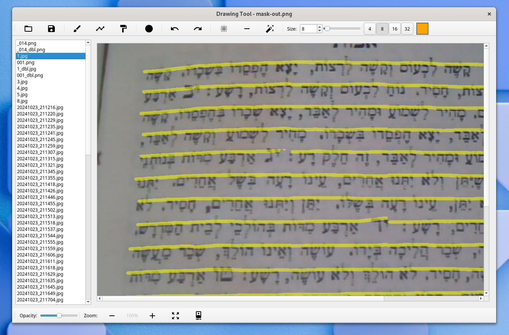

# ORTHO Mask Editor

A PyQT5-based mask editor tool for the ORTHO (Old Research Text Hebrew OCR) project. This tool helps create training data for the ORTHO U-Net AI model by allowing users to create and edit image masks of Hebrew text documents.

## About ORTHO

[ORTHO (Old Research Text Hebrew OCR)](https://github.com/yaacov/ortho-editor) is a project focused on optical character recognition for historical Hebrew texts. The project uses a U-Net architecture for text segmentation and recognition.

## Screenshot



## Purpose

This mask editor serves as a crucial tool in the ORTHO pipeline by:

- Creating binary masks for training data
- Marking text regions in historical Hebrew documents
- Preparing ground truth data for the U-Net model
- Enabling manual correction of automated segmentation results

## Installation

### Prerequisites

- Python 3.6 or higher
- PyQt5
- NumPy

### Setup

You can install ORTHO Mask Editor using pip:

```bash
pip install ortho-editor
```

Or install from source:

1. Clone the repository:

```bash
git clone https://github.com/yaacov/ortho-editor.git
cd ortho-editor
```

## Usage

1. Prepare a directory that contains two subdirectories named `inputs` and `targets`.  
   - `inputs` holds the original images.  
   - `targets` holds the corresponding mask images (same filenames, same dimensions).

2. Install the required dependencies:
    ```bash
    pip install -r requirements.txt
    ```

3. Run the application:
    ```bash
    python main.py
    ```

4. When prompted, select your directory with `inputs` and `targets` subdirectories.  

5. A list of files from the `inputs` folder will appear. Choose a file to display the image as the background, then draw or edit the mask on top.

## Development

The project includes a Makefile with useful commands for development:

```bash
make install  # Install the required packages
make run      # Run the editor
make format   # Format the code using black
make lint     # Lint the code using flake8
make package  # Create a pip package
make push     # Upload package to PyPI using twine
make clean    # Remove build artifacts and Python cache files
```

If you're contributing to the project, make sure to run `make format` and `make lint` before submitting your changes.

## License

MIT License
